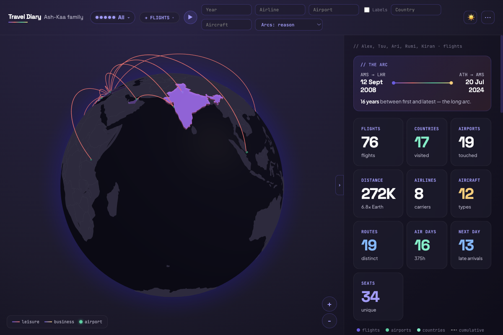
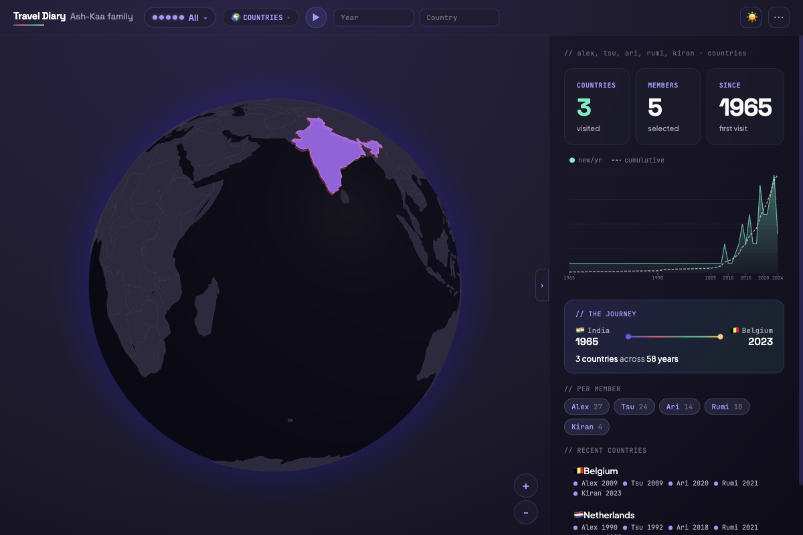

# Travel Diary

A personal travel visualization app that puts your family's flight history on a 3D globe — because spreadsheets don't do justice to 10,000 km arcs over the Atlantic.

**[Try the demo](https://www.prasadgupte.com/travel-diary-demo/)** — loaded with sample data for the fictional Ash-Kaa family.

  

<p align="center">
  
</p>

---

## The idea

I wanted a single place to see everywhere our family has flown — not as a list, but as arcs on a spinning globe. Who's been where, when, on what airline, in what seat. A visual family travel diary that makes you go "wait, we really flew *that* much?"

The demo is built around the **Ash-Kaa family**: Alex and Tsu (the parents, based in Amsterdam), their kids Ari and Rumi, and Kiran (grandmother, based in Mumbai). Five people, very different travel fingerprints — from Kiran's Emirates hops between BOM and DXB to Alex's KLM marathons to Singapore.

## Can you figure these out?

Fire up [the demo](https://www.prasadgupte.com/travel-diary-demo/) and see if you can answer:

1. What is the **southernmost airport** anyone in the Ash-Kaa family has visited?
2. What is **Rumi's longest flight** — and how many hours was it?
3. Which family member has flown with the **most different airlines**?
4. How many **countries has Kiran visited** that nobody else in the family has?

*(Hint: the stats sidebar, country mode, and member filters are your friends.)*

<p align="center">
  
</p>

## What it does

- **3D globe** with great-circle arcs — watch flights trace across the planet (Three.js + three-globe)
- **2D map** fallback — D3-geo equirectangular projection for when you want flat
- **Autoplay mode** — flights animate chronologically with year markers, speed control, and a timeline scrubber
- **Country heatmap** — toggle to Countries mode to see visited/lived/flown-over countries per person
- **Multi-member filtering** — toggle family members on/off, each with their own color
- **Stats dashboard** — flights, distance, airports, airlines, aircraft, routes, trips — all clickable for drill-down
- **Flight quiz** — test yourself: guess the longest flight, the most-visited airport, the airline from a route
- **Arc color modes** — color by reason (leisure/business), airline, or alliance (Star/Oneworld/SkyTeam)
- **Data quality checker** — flags missing fields, impossible durations, unknown airports
- **Country enrichment** — click a country for capital, population, currency, neighbours (REST Countries API)
- **Tweaks panel** — three color schemes (Ink, Aurora, Mesh), toggleable airport labels
- **Light & dark mode** — full theme support with CSS custom properties


## Architecture choices

**No build step.** Zero. The whole app is vanilla HTML + CDN scripts with in-browser Babel JSX transpilation. No webpack, no vite, no npm install. Open `index.html` with a local server and it just works. I wanted something I could hack on from any machine without setting up a toolchain.

**Script load order is the dependency graph.** Components export to `window.*` and are loaded as `<script type="text/babel">` tags in `index.html`. Order matters — `data.js` before `globe.jsx` before `app.jsx`. Old-school, explicit, zero magic.

**One file does a lot.** `app.jsx` is ~1,600 lines — the entire shell, all state management, filtering, sidebar, stats. No state library, no router. React `useState` and `useEffect` all the way. It's a personal tool, not a SaaS product. The right abstraction count is "as few as possible."

**Design system as CSS custom properties.** `tokens.css` defines the full type scale (Space Grotesk headings, Plus Jakarta Sans body, JetBrains Mono for codes), color schemes, spacing, and component tokens. Every visual choice flows from tokens — which is how three color schemes and light/dark mode work without touching component code.

**Data stays private.** `flights.json` and `data/` are gitignored. Your real travel data never leaves your machine. The repo ships with sample CSVs so the demo works out of the box.

**Flight management CLI.** `tools/flights.sh` is an interactive menu for adding flights — paste a raw itinerary, an LLM extracts structured rows, and they're appended to your CSV. Because nobody wants to hand-type IATA codes.

## Project structure

```
travel-diary/
├── index.html                 ← entry point, script load order
├── tokens.css                 ← design system (CSS custom properties)
├── app.jsx                    ← main shell: state, filters, sidebar, stats
├── globe.jsx                  ← 3D globe renderer (Three.js + three-globe)
├── map2d.jsx                  ← 2D map renderer (D3-geo)
├── data.js                    ← CSV parser, airport DB, data loader
├── autoplay.jsx               ← chronological flight/country playback
├── timeline.jsx               ← scrubber bar with year ticks
├── charts.jsx                 ← stats charts (bar, pie, etc.)
├── quiz.jsx                   ← interactive flight quiz
├── tweaks-panel.jsx           ← runtime color scheme picker
├── enrichment.js              ← country enrichment (REST Countries API)
├── iso-lookup.js              ← ISO code → country name/flag
├── airport_enrichment.js      ← elevation, ICAO codes (OurAirports)
├── flights.json.example       ← config template
│
├── sample/                    ← demo data (Ash-Kaa family)
│   ├── sample_tracker.csv     ← fallback single-user demo
│   ├── sample_alex.csv … sample_kiran.csv
│   └── sample_countries.csv
│
├── tools/                     ← CLI for managing flight data
│   ├── flights.sh             ← interactive menu (add flights, refresh master data)
│   ├── extract_flight.py      ← LLM-powered itinerary → CSV rows
│   ├── update_tracker.py      ← append rows to a member's CSV
│   ├── fetch_master.py        ← download OpenFlights reference data
│   ├── group_trips.py         ← group flights into trips
│   ├── normalize_airlines.py  ← standardize airline names
│   └── requirements.txt
│
├── docs/                      ← screenshots for this README
├── data/                      ← your real flight CSVs (gitignored)
└── master_data/               ← OpenFlights airport cache (gitignored)
```

## Data format

### Flight CSVs (OpenFlights-compatible)

```csv
Date,From,To,Flight_Number,Airline,Distance,Duration,Seat,Seat_Type,Class,Reason,Plane,Registration,Trip,Note
2024-08-15 09:30:00,JFK,LHR,BA178,British Airways,5539,07:10,22A,W,Y,L,Boeing 777-300ER,,,,
```

`From`/`To` are IATA codes. `Reason`: `L` leisure, `B` business, `O` other. `Class`: `Y`/`J`/`F`.

### Countries CSV (semicolon-delimited)

```csv
country;iso;alex;tsu;ari;rumi;kiran
France;FR;2013;2014;2022;2022;
Kenya;KE;2024;2024;;;;
```

Columns after `iso` are member names. Values are first-visit year.

## Run it yourself

```sh
python3 -m http.server 8080
# open http://localhost:8080
```

Without `flights.json`, the app loads the Ash-Kaa sample data automatically.

To use your own data, create `flights.json` pointing to your CSVs (see `flights.json.example`) and drop your files in `data/`.

## Credits

- Globe rendering: [three-globe](https://github.com/vasturiano/three-globe) by Vasco Asturiano
- Country polygons: [Natural Earth](https://www.naturalearthdata.com/) via [world-atlas](https://github.com/topojson/world-atlas)
- Airport data: [OpenFlights](https://openflights.org/data.html)
- Design system + app: Prasad Gupte, with significant help from Claude
